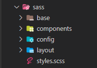

# Frontend Mentor - Launch countdown timer solution

This is a solution to the [Launch countdown timer challenge on Frontend Mentor](https://www.frontendmentor.io/challenges/launch-countdown-timer-N0XkGfyz-). Frontend Mentor challenges help you improve your coding skills by building realistic projects.

## Overview

### The challenge

Users should be able to:

-   See hover states for all interactive elements on the page
-   See a live countdown timer that ticks down every second (start the count at 14 days)
-   **Bonus**: When a number changes, make the card flip from the middle

### Screenshot


## My process

### Built with

-   Semantic HTML5 markup
-   SASS custom properties
-   BEM
-   Flexbox
-   Mobile-first workflow
-   Vanilla JS

### What I learned

-   Create reusable structures with the BEM methodology

```html
<div class="counter">
    <div class="counter__box">
        <p class="counter__number">08</p>
    </div>
    <p class="counter__date">Minutes</p>
</div>
```

-   Modularize SASS files in this folder architecture
-   To use the :: after and :: before Pseudo-elements



-   Use a setTimeout ()

```JavaScript
    setTimeOut((parameters) () => {
        function
    }, time)
```

-   Better document README's

### Continued development

Know how to better optimize the JS and the functions so as not to repeat so much code. I know I could "paint" the counter numbers with something like this:

```JavaScript
const array = [14,0,0,0]

for (let i = 0; i < counters.length; i++) {
    counters[i].textcontent = array[i]
}
```

But then I don't know how to do a function that removes the if's string. Because the function does not rewrite the original value of the variables

_See the [JS file](https://github.com/JuanDelgado1110/CountdownTimer/blob/master/project/javascript/scripts.js)_

### Useful resources

-   [FontAwesome](https://fontawesome.com/) - This page provided me with the social media icons
-   [Google Fonts](https://fonts.google.com/) - This page provided me with the fonts

### Links

-   [Solution](https://your-live-site-url.com)
-   [Live Site](https://juandelgado1110.github.io/CountdownTimer)
